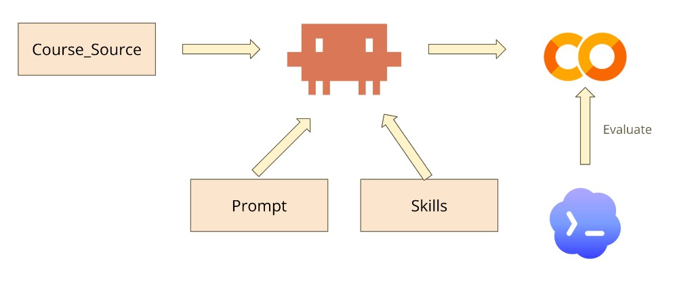
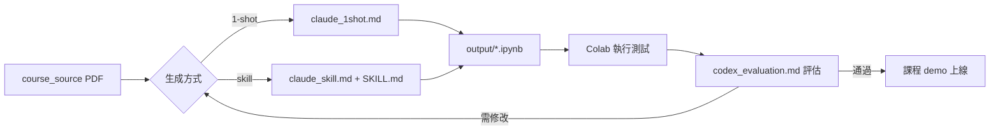

# CSWIDGAgent

**Computer Science Webcourse Interactive Demo Generating Agent**

本 repository 用於從 NTU 資工／機器學習課程講義出發，由 AI agent 自動產生可在 **Google Colab** 上執行的互動式 Jupyter notebook demo，供學生逐步操作、視覺化與實驗演算法或 ML 概念。

## 系統架構

```
Course Source (PDF) ──┐
                      ├──► Agent ──► Google Colab Notebook ──► Evaluate
Prompt ───────────────┤
Skills ───────────────┘
```



| 元件 | 說明 |
|------|------|
| **Course Source** | 課程講義 PDF，放在 `course_source/`（gitignored） |
| **Prompt** | 引導 agent 生成或評估 notebook 的 prompt 模板，放在 `prompt/` |
| **Skills** | Agent 可載入的結構化指令，定義 notebook 格式與 Colab 規範 |
| **Agent** | 在 Cursor / Claude Code 等環境中執行的 coding agent |
| **Google Colab** | 產出的互動式 notebook，學生可直接開啟執行 |
| **Evaluate** | 依評估 prompt 檢查可執行性、正確性、互動性與教學品質 |

## Repository 結構

```
CSWIDGAgent/
├── course_source/              # 講義 PDF（gitignored）
│   ├── Dijkstra.pdf
│   └── KVcahce.pdf
├── prompt/                     # Agent prompt 模板
│   ├── claude_1shot.md         # 單次 prompt 生成（不載入 skill）
│   ├── claude_skill.md         # 載入 skill 的生成 prompt
│   └── codex_evaluation.md     # Notebook 品質評估 prompt
├── .claude/skills/
│   └── colab-demo-generator/   # Colab demo 生成 skill
│       └── SKILL.md
├── output/                     # Agent 產出的 notebook
│   ├── dijkstra_interactive.ipynb
│   ├── kvcache_interactive.ipynb
│   ├── kvcache_interactive_skill.ipynb
│   └── kvcahce_interactive_skill_refined.ipynb
├── docs/
│   └── architecture.png        # 系統架構圖
├── CLAUDE.md                   # Agent 專案說明
└── README.md
```

## Prompt 一覽

本專案提供兩種 **生成** 與一種 **評估** prompt，方便比較不同 agent 設定下的產出品質。

| 檔案 | 用途 | 說明 |
|------|------|------|
| [`prompt/claude_1shot.md`](prompt/claude_1shot.md) | 1-shot 生成 | 僅用自然語言描述任務，不顯式載入 skill；結構較精簡 |
| [`prompt/claude_skill.md`](prompt/claude_skill.md) | Skill 生成 | 指示 agent 載入 `colab-demo-generator` skill 後再生成；結構與規範較完整 |
| [`prompt/codex_evaluation.md`](prompt/codex_evaluation.md) | 品質評估 | 對已產出的 notebook 做八面向評分與改進建議 |

### `claude_1shot.md`

適合快速試跑、或作為 baseline。要求 notebook 包含概念說明、可執行 demo、互動 widget、學生練習題與程式註解，將 `xxx.pdf` 替換為實際講義檔名即可使用。

### `claude_skill.md`

適合需要一致格式與 Colab 相容性時使用。模板如下：

```
/colab-demo-generator Use this skills and create a colab-demo for course_source/xxx.
Name it as xxx.ipnyb
```

將 `xxx` 替換為講義主題或檔名（不含副檔名），agent 會依 [`.claude/skills/colab-demo-generator/SKILL.md`](.claude/skills/colab-demo-generator/SKILL.md) 產出含學習目標、互動控制、視覺化、反思題等完整結構的 notebook。

## 快速開始

### 1. 放入課程素材

將講義 PDF 放到 `course_source/`。目前已有範例：

- `Dijkstra.pdf` — 最短路徑演算法
- `KVcahce.pdf` — Transformer KV Cache

### 2. 用 Agent 生成 Notebook

在 Cursor 或 Claude Code 中，依需求選擇其中一種方式：

**方式 A — 1-shot（`claude_1shot.md`）**

1. 提供 `course_source/` 中的講義
2. 貼上 `prompt/claude_1shot.md` 內容，將 `xxx.pdf` 改為實際檔名
3. 將產出的 `.ipynb` 存到 `output/`

**方式 B — Skill（`claude_skill.md`）**

1. 提供 `course_source/` 中的講義
2. 貼上 `prompt/claude_skill.md` 內容，將 `xxx` 改為講義主題
3. Agent 自動載入 `colab-demo-generator` skill 並依規範生成
4. 將產出的 `.ipynb` 存到 `output/`

### 3. 評估產出品質

使用 `prompt/codex_evaluation.md` 作為評估 prompt，從以下八個面向打分（1–5 分）：

1. **Executability** — 能否無錯誤從頭跑到尾
2. **Concept Correctness** — 演算法／數學／ML 是否正確
3. **Interactivity** — 互動元件是否有助學習
4. **Visualization Quality** — 圖表是否清楚、有教學價值
5. **Pedagogical Value** — 學習目標、引導與練習是否完善
6. **Alignment with Source Material** — 是否對齊講義範圍
7. **Robustness** — 參數變動、無 GPU 等情境是否仍可用
8. **Simplicity and Maintainability** — 程式是否易讀、不過度複雜

評估結果會產出總評、分數表、優缺點、具體 bug、教學改進建議，以及是否可直接使用的建議。

## 已產出範例

| Notebook | 主題 | 生成方式 |
|----------|------|----------|
| `dijkstra_interactive.ipynb` | Dijkstra 最短路徑 | 1-shot |
| `kvcache_interactive.ipynb` | KV Cache | 1-shot |
| `kvcache_interactive_skill.ipynb` | KV Cache | Skill（`colab-demo-generator`） |
| `kvcahce_interactive_skill_refined.ipynb` | KV Cache | Skill + 評估迭代 |

將 `output/` 中的 notebook 上傳至 [Google Colab](https://colab.research.google.com/) 即可執行。

## 工作流程建議



1. **Generate** — 以 1-shot 或 skill 方式生成初版 notebook  
2. **Run** — 在 Colab 從頭執行所有 cell  
3. **Evaluate** — 用評估 prompt 取得結構化回饋  
4. **Refine** — 依回饋修改並存成新版本（如 `*_refined.ipynb`）  
5. **Deploy** — 將通過評估的 notebook 提供給學生

## 相關文件

- [`CLAUDE.md`](CLAUDE.md) — Agent 環境與專案概述
- [`prompt/claude_1shot.md`](prompt/claude_1shot.md) — 1-shot 生成 prompt
- [`prompt/claude_skill.md`](prompt/claude_skill.md) — Skill 生成 prompt
- [`.claude/skills/colab-demo-generator/SKILL.md`](.claude/skills/colab-demo-generator/SKILL.md) — Notebook 生成規範
- [`prompt/codex_evaluation.md`](prompt/codex_evaluation.md) — 評估標準與輸出格式