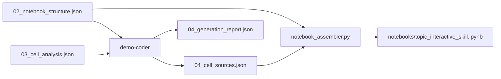

# Phase 2: Cell Sources Schema & Notebook Assembler

## Overview

Phase 2 splits Stage 4 (`demo-coder`) into **content generation** and **notebook assembly**:



| Component | Responsibility |
|-----------|----------------|
| `demo-coder` | Produce per-cell `source` text (markdown prose + Python code) |
| `notebook_assembler.py` | Merge structure + sources into valid nbformat 4 `.ipynb` |
| `pipeline_validator.py` | Verify `04_cell_sources.json` aligns with `02` before assembly |

---

## Artifact: `pipeline_outputs/04_cell_sources.json`

Produced by `demo-coder`. This is the **content payload** — not the final notebook.

### Minimum required fields

```json
{
  "topic": "kvcache",
  "notebook_title": "KV Cache: Efficient LLM Inference — Interactive Demo",
  "source_artifacts": {
    "structure": "pipeline_outputs/02_notebook_structure.json",
    "analysis": "pipeline_outputs/03_cell_analysis.json"
  },
  "cells": [
    {
      "cell_id": "C01",
      "cell_type": "markdown",
      "source": "# KV Cache: Efficient LLM Inference — Interactive Demo\n\n...",
      "generation_notes": "Title block with roadmap table per C01 goal."
    },
    {
      "cell_id": "C02",
      "cell_type": "code",
      "source": "# Setup\n!pip install -q anthropic\n\nimport numpy as np\n...",
      "generation_notes": "Imports and version checks per C02 spec."
    }
  ],
  "assumptions": []
}
```

### Field definitions

| Field | Type | Required | Description |
|-------|------|----------|-------------|
| `topic` | string | yes | Run topic slug; used for notebook naming (`<topic>_interactive_skill.ipynb`). |
| `notebook_title` | string | yes | Copied from `02.notebook_title` for traceability. |
| `source_artifacts` | object | yes | Paths to upstream artifacts this content was derived from. |
| `source_artifacts.structure` | string | yes | Must reference `02_notebook_structure.json`. |
| `source_artifacts.analysis` | string | yes | Must reference `03_cell_analysis.json`. |
| `cells` | array | yes | One entry per cell in `02.cells`, same order. |
| `cells[].cell_id` | string | yes | Must match `02.cells[i].cell_id`. |
| `cells[].cell_type` | string | yes | `"markdown"` or `"code"`; must match stage 2. |
| `cells[].source` | string | yes | Raw cell content as plain text. Newlines are `\n`. Not an ipynb JSON fragment. |
| `cells[].generation_notes` | string | yes | Brief note on how the cell goal/spec was addressed (can be `""`). |
| `assumptions` | array | yes | Unresolved limitations for this content pass. |

### `source` format rules

**All cell types**

- `source` is a single string, not a list of lines.
- The assembler converts it to nbformat's line-array representation.
- Must be non-empty after `.strip()`.

**Markdown cells**

- Standard GitHub-flavored markdown.
- May include LaTeX (`$...$`, `$$...$$`) for Colab rendering.

**Code cells**

- Valid Python for Colab, except allowed Jupyter prefixes per line:
  - `!pip install ...`
  - `%matplotlib inline`
- Shell magics (`!`) and line magics (`%`) are preserved as-is.
- No JSON escaping concerns — the artifact is UTF-8 JSON with the string escaped normally.

### Validation rules (vs `02_notebook_structure.json`)

1. `len(cells)` == `len(02.cells)`
2. For every index `i`: `cell_id` and `cell_type` match `02.cells[i]`
3. Every `cell_id` in `02.cells` appears exactly once
4. Every `source` is non-empty
5. For each code cell in `02`, a matching entry exists in `03.cell_specs` (checked at pipeline level, not in this file)

### What demo-coder does **not** put in this file

- nbformat `metadata`, `kernelspec`, `language_info`
- Per-cell `outputs`, `execution_count`
- The final `04_generation_report.json` (separate artifact)

---

## Artifact: `04_generation_report.json` (unchanged role)

Still produced by `demo-coder` after content generation. In Phase 2 it documents the **run outcome**; the assembler does not write this file.

The report's `generated_cells` still lists every cell from `02` with `status` and `notes`. The runner verifies the assembled notebook against both `02` and the report.

---

## Assembler interface: `scripts/lib/notebook_assembler.py`

### Public types

```python
@dataclass
class AssembleConfig:
    python_version: str = "3.10.0"
    indent: int = 1
    ensure_parent_dir: bool = True

@dataclass
class AssembleResult:
    output_path: Path
    total_cells: int
    code_cells: int
    markdown_cells: int
    notebook_bytes: int
```

### Public functions

#### `assemble_notebook(structure, cell_sources, output_path, *, config=None) -> AssembleResult`

Core assembly function.

**Inputs**

| Arg | Type | Description |
|-----|------|-------------|
| `structure` | `dict` | Parsed `02_notebook_structure.json` |
| `cell_sources` | `dict` | Parsed `04_cell_sources.json` |
| `output_path` | `Path` | Destination `.ipynb` path |
| `config` | `AssembleConfig \| None` | Optional formatting options |

**Behavior**

1. Validate `cell_sources` against `structure` (raises `AssemblyError` on mismatch).
2. Walk `structure["cells"]` in order; look up matching `source` by `cell_id`.
3. Build nbformat 4 document with standard Colab-compatible metadata.
4. Write JSON to `output_path`.
5. Return `AssembleResult` with cell counts and file size.

**Does not**

- Execute notebook cells
- Call LLM
- Modify `04_cell_sources.json` or `04_generation_report.json`

#### `assemble_from_files(structure_path, cell_sources_path, output_path, *, config=None) -> AssembleResult`

Convenience wrapper: load JSON files, delegate to `assemble_notebook`.

#### `expected_notebook_path(topic: str) -> str`

Returns `notebooks/{topic}_interactive_skill.ipynb`.

### Error type

```python
class AssemblyError(Exception):
    """Raised when cell sources cannot be assembled into a notebook."""
```

Distinct from `ValidationError` in `pipeline_validator.py`. The assembler may raise `AssemblyError`; the runner can catch and report it.

---

## Stage 4 runner flow (Phase 2)

```
1. demo-coder agent
   ├─ read 02 + 03
   ├─ write pipeline_outputs/04_cell_sources.json
   └─ return 04_generation_report.json (stdout)

2. pipeline_validator.validate_cell_sources(structure, cell_sources)

3. notebook_assembler.assemble_from_files(
       structure_path, cell_sources_path, notebook_path
   )

4. pipeline_validator.validate_demo_coder_outputs(report, structure, root_dir)

5. write run_log.json (generation_mode: artifact_driven)
```

---

## demo-coder responsibilities after Phase 2

| Task | Owner |
|------|-------|
| Read `02` for cell order, types, goals | demo-coder |
| Read `03` for code implementation plans | demo-coder |
| Write markdown `source` per `goal` | demo-coder |
| Write code `source` per `implementation_plan` | demo-coder |
| Write `04_cell_sources.json` | demo-coder |
| Write `04_generation_report.json` | demo-coder |
| Build nbformat / write `.ipynb` | **notebook_assembler** |
| Verify cell counts match | **pipeline_validator** |

---

## Example CLI (for manual testing)

```bash
python3 -m scripts.lib.notebook_assembler \
  --structure pipeline_outputs/02_notebook_structure.json \
  --cell-sources pipeline_outputs/04_cell_sources.json \
  --output notebooks/kvcache_interactive_skill.ipynb
```

---

## Migration from Phase 1

| Phase 1 | Phase 2 |
|---------|---------|
| demo-coder writes `.ipynb` directly | demo-coder writes `04_cell_sources.json` |
| Assembler N/A | runner calls assembler after demo-coder |
| `demo-coder.md` lists `.ipynb` as agent output | `.ipynb` listed as assembler output |
| Validator checks notebook after agent | Validator checks cell_sources, then notebook after assembler |

Existing `02` + `03` artifacts remain valid. To migrate KV Cache:

```bash
# Bootstrap cell sources from existing notebook (regression)
python3 scripts/bootstrap_cell_sources.py \
  --notebook notebooks/kvcache_interactive_skill.ipynb \
  --topic kvcache

# Assemble notebook from cell sources (no agents)
./scripts/run_pipeline.sh --assemble-only --topic kvcache
```

**Status:** Phase 2 integrated — `pipeline_runner.py` calls assembler after demo-coder; `--assemble-only` available for regression.
