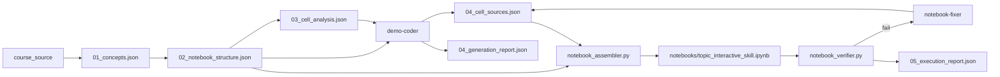

# Colab Demo Generator Pipeline

## Design Intent

The pipeline is **artifact-driven**: each stage reads the previous stage's JSON output and produces the next artifact. Stage 4 (`demo-coder`) must derive the final notebook from `02_notebook_structure.json` and `03_cell_analysis.json` — not from a hand-written topic script.



## Official Entry Point

```bash
./scripts/run_pipeline.sh --source course_source/<file> --topic <topic>
```

This invokes `scripts/lib/pipeline_runner.py`, which:

1. Embeds each agent's `.md` instructions in the prompt (not just the file path).
2. Validates minimum required JSON fields after stages 1–3.
3. After demo-coder: validates `04_cell_sources.json`, runs `notebook_assembler.py`, verifies the notebook.
4. Stage 5: runs `notebook_verifier.py` (syntax + execution); on failure, invokes `notebook-fixer`, re-assembles, and re-verifies (up to `--max-fix-attempts`).
5. Writes `pipeline_outputs/run_log.json` with a `generation_mode` field.

Assemble-only (no agents; for regression):

```bash
./scripts/run_pipeline.sh --assemble-only --topic kvcache
```

## Stage Outputs

| Stage | Agent | Input | Output |
|-------|-------|-------|--------|
| 1 | concept-extractor | course source | `01_concepts.json` |
| 2 | notebook-architect | `01_concepts.json` | `02_notebook_structure.json` |
| 3 | cell-analyzer | `02_notebook_structure.json` | `03_cell_analysis.json` |
| 4a | demo-coder | `02` + `03` | `04_cell_sources.json` + `04_generation_report.json` |
| 4b | notebook_assembler | `02` + `04_cell_sources.json` | `notebooks/<topic>_interactive_skill.ipynb` |
| 5a | notebook_verifier | `notebook` + `02` | `05_execution_report.json` |
| 5b | notebook-fixer (on failure) | `05` + `04_cell_sources.json` + `02` + `03` | repaired `04_cell_sources.json` (re-assembled + re-verified) |

## Stage 5: Verification + Auto-fix

`notebook_verifier.py` is a pure-Python component (mirrors `notebook_assembler.py`):

1. **Syntax check** — each code cell is run through IPython's `TransformerManager` (so
   `%magic` / `!shell` lines don't false-positive) then `compile()`-checked.
2. **Execution** — the whole notebook runs top-to-bottom under `nbclient` (`allow_errors=True`
   so every failing cell is reported, not just the first). Errors are mapped back to
   `cell_id` by structure order.

If verification fails and auto-fix is enabled, the `notebook-fixer` agent repairs the
failing cells in `04_cell_sources.json`; the runner re-assembles and re-verifies, looping
up to `--max-fix-attempts` (default 2).

Stage 5 flags: `--skip-verify`, `--no-autofix`, `--max-fix-attempts N`, `--cell-timeout`,
`--startup-timeout`. Re-verify an existing notebook with `--from-stage 5`. Standalone:

```bash
python3 scripts/lib/notebook_verifier.py \
  --notebook notebooks/<topic>_interactive_skill.ipynb \
  --structure pipeline_outputs/02_notebook_structure.json \
  --output pipeline_outputs/05_execution_report.json
```

`05_execution_report.json` is the authoritative source of `summary.top_to_bottom_runnable`
in `run_log.json` (real kernel execution, not the demo-coder self-report).

**Dependencies:** Stage 5 execution requires `nbclient`, `nbformat`, and an `ipykernel`
(`python3`) kernel. If the notebook imports heavy third-party packages, they must be
installed (or the notebook must `!pip install` them) for execution to pass; otherwise
the verifier reports the import failure and `notebook-fixer` is asked to repair it.

## Generation Modes (`run_log.json`)

| Mode | Meaning |
|------|---------|
| `artifact_driven` | Notebook assembled from `04_cell_sources.json` via `notebook_assembler.py` (required for new runs). |
| `legacy_script` | Notebook produced by a one-off script under `scripts/legacy/` (pre-Phase-1 KV Cache run). |

New runs via `run_pipeline.sh` must record `generation_mode: "artifact_driven"`. If stage 4 cannot produce a notebook from artifacts, the runner exits with an error instead of silently succeeding.

## Legacy Scripts (Deprecated)

The following are **not** part of the official pipeline. They exist only as historical references or golden outputs.

| Script | Status | Notes |
|--------|--------|-------|
| `scripts/legacy/gen_kvcache_notebook.py` | Deprecated | Hard-coded 23-cell KV Cache notebook. Does **not** read `03_cell_analysis.json`. Used for the initial KV Cache delivery before Phase 1. |

Do not add new `gen_<topic>_notebook.py` scripts. Extend the artifact-driven stage 4 path instead (see [Phase 2 spec](phase2_cell_sources_and_assembler.md): `04_cell_sources.json` + `notebook_assembler.py`).

## Known Gap (KV Cache Initial Run)

The first KV Cache run completed stages 1–3 correctly but stage 4 used `scripts/legacy/gen_kvcache_notebook.py` instead of `demo-coder` reading artifacts. Evidence:

- `run_log.json` records `generation_mode: "legacy_script"`.
- `gen_kvcache_notebook.py` contains inline cell strings (`C01`…`C23`) and never loads `03_cell_analysis.json`.

Artifacts from that run remain valid inputs for a proper artifact-driven re-run of stage 4.

## `run_log.json` Schema

```json
{
  "run_id": "run-20260601T120000Z",
  "timestamp_utc": "2026-06-01T12:00:00Z",
  "topic": "kvcache",
  "course_source_path": "course_source/KVcahce.pdf",
  "generation_mode": "artifact_driven",
  "stage_status": {
    "concept_extractor": "completed",
    "notebook_architect": "completed",
    "cell_analyzer": "completed",
    "demo_coder": "completed",
    "notebook_verifier": "completed"
  },
  "artifacts": {
    "concepts": "pipeline_outputs/01_concepts.json",
    "structure": "pipeline_outputs/02_notebook_structure.json",
    "analysis": "pipeline_outputs/03_cell_analysis.json",
    "cell_sources": "pipeline_outputs/04_cell_sources.json",
    "generation_report": "pipeline_outputs/04_generation_report.json",
    "execution_report": "pipeline_outputs/05_execution_report.json",
    "final_notebook": "notebooks/kvcache_interactive_skill.ipynb"
  },
  "summary": {
    "top_to_bottom_runnable": false,
    "syntax_ok": false,
    "verified_by_execution": true,
    "total_cells": 0,
    "code_cells": 0,
    "markdown_cells": 0
  },
  "legacy_notes": null,
  "errors": []
}
```

`legacy_notes` is set only when `generation_mode` is `legacy_script`.
